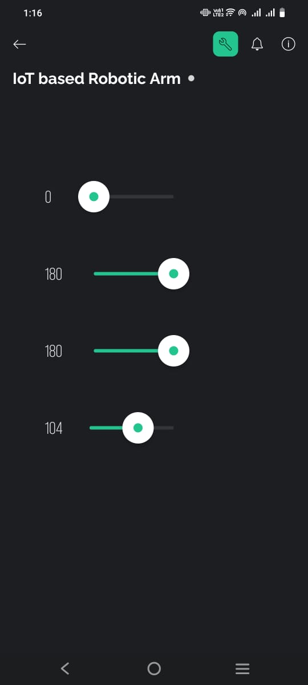
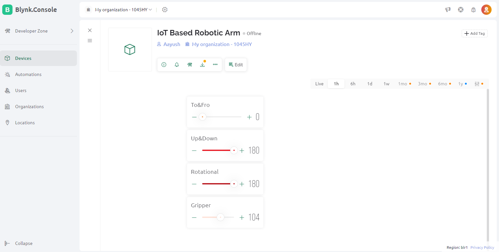
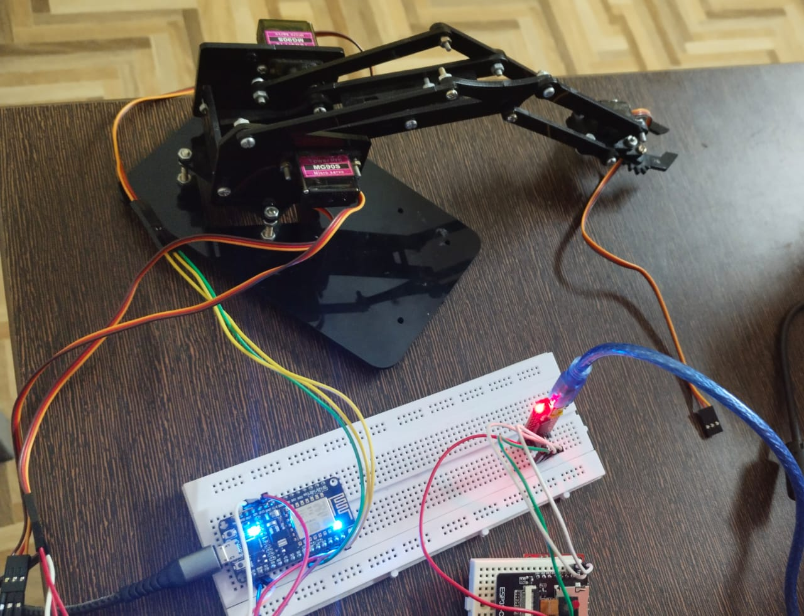

# Robo_arm

This repository contains the project code and documentation for an IoT-based **Pick & Place Robotic Arm** with 4 degrees of freedom. The robotic arm is controlled using the **Blynk app** via the internet. The control system leverages **NodeMCU** and **PWM** (Pulse Width Modulation) for controlling the 4 servo motors that drive the arm's movement.

## Project Overview

The robotic arm is designed to move and pick objects based on commands sent from a mobile app. The arm's movements are controlled by adjusting the PWM values for the four servo motors. The Blynk app sends these values over the internet to the **NodeMCU**, which processes and controls the servo motors.

### Features:
- 4 Degrees of Freedom (DOF)
- Control via **Blynk App** on mobile devices
- NodeMCU for internet connectivity and control
- Easy-to-use mobile dashboard interface

## Hardware Requirements

- **NodeMCU** (ESP8266 Wi-Fi Module)
- **4 Servo Motors** (for controlling the 4 DOF of the robotic arm)
- **Jumper Wires**
- **Power Supply** for the servos and NodeMCU
- **Robotic Arm** (can be 3D printed or purchased)

## Software Requirements

- **Arduino IDE** for writing and uploading the code
- **Blynk App** (available on Android and iOS)
- **Blynk Account** (for creating and configuring the mobile app interface)
- **Blynk Library** installed in Arduino IDE

## How It Works

1. **Mobile App Control**: The Blynk app is used to control the robotic arm. The app sends PWM values over the internet to the **NodeMCU**.
2. **NodeMCU Communication**: The NodeMCU receives the data and adjusts the PWM values accordingly to control the four servo motors.
3. **Robotic Arm Movement**: The servo motors, powered by an external power supply, move the robotic arm according to the received commands.

## Getting Started

### 1. Install Dependencies
- Install **Arduino IDE** if you haven't already.
- Install the **Blynk library** in the Arduino IDE.
- Set up the **Blynk app** on your mobile device and create an account.

### 2. Setup Blynk App
- Open the **Blynk app** and create a new project.
- Add 4 **Slider Widgets** to control each servo (you can customize the widget settings to control the PWM values).
- Generate and copy the **Auth Token** from the Blynk app and add it to your Arduino code.

### 3. Upload the Code
- Open the provided `.ino` file in the **Arduino IDE**.
- Set the correct board and port for **NodeMCU**.
- Upload the code to the NodeMCU.

### 4. Wiring
- Connect the **servo motors** to the NodeMCU, using PWM-capable pins.
- Connect the **NodeMCU** to your computer via USB for initial programming.
- Power the servo motors using an external power supply.

### 5. Test the System
- Open the **Blynk app** on your mobile phone and press the "Play" button to start controlling the robotic arm.

## File Structure

- **`/src/`**: Contains the Arduino code (`.ino`) for controlling the robotic arm.
- **`/img/`**: Contains images for the project.
  - `mobile_dashboard.jpg`: Screenshot of the Blynk mobile dashboard interface.
  - `web.jpg`: Screenshot of the webapp dashboard interface (if applicable).
  - `working_model.jpg`: Image of the physical robotic arm prototype.

## Images

Here are some visual references for the project:

### Mobile Dashboard

*Mobile Dashboard for controlling the robotic arm via Blynk app.*

### Web Dashboard

*Web Dashboard interface (if used).*

### Physical Model

*Physical Prototype of the Robotic Arm.*

## License

This project is licensed under the MIT License - see the [LICENSE](LICENSE) file for details.

